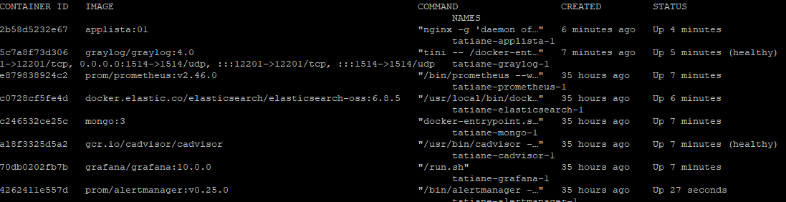

## Projeto - Observability

Projeto  feito para o módulo de Observability do curso [Ser+Tech](https://ada.tech/sou-aluno/programas/nuclea-ser-mais-tech) ministrado pela [Ada.Tech](https://www.linkedin.com/school/adatechbr/) em parceria com a [Núclea](https://www.linkedin.com/company/nucleabr/).

## Equipe

- [Fernanda Gabbai](https://github.com/fergabbai)
- [Michelle Lira](https://github.com/michelle-lira)
- [Andreza Pipolo](https://github.com/andrezapipolo)
- [Tatiane Paiva](https://github.com/Tatimoriam)

## Proposta

Realizar a criação e configuração do ambiente de observability utilizando as ferramentas: Prometheus, Alertmanager, Grafana, Cadvisor e um Container com uma aplicação HTTP.
Realizar a criação e configuração do ambiente de Logs utilizando as ferramentas: MongoDB, Elasticsearch e Graylog gerando logs básicos das aplicações;

## O Projeto

### Construindo a Infraestrutura

Este projeto foi feito utilizando uma Máquina Virtual com Ubuntu Server 22.04.
A VM (Máquina Virtual) foi configurada com rede em modo Bridge.
Primeiramente ao criar a VM  fizemos a instalação das ferramentas necessárias:

```
sudo apt update
sudo apt install
sudo apt install net-tools
curl -fsSL https://get.docker.com/ | sh
sudo curl -L https://github.com/docker/compose/releases/latest/download/docker-compose-$(uname -s)-$(uname -m) -o /usr/local/bin/docker-compose
sudo chmod +x /usr/local/bin/docker-compose
docker-compose –-version
```

Após termos o docker instalado e funcional, agora iremos copiar o conteúdo deste repositório para a máquina virtual.

```
sudo apt install git
git clone https://github.com/Tatimoriam/nuclea-observability.git
cp -r nuclea-observability/alertmanager/ .
cp -r nuclea-observability/grafana/ .
cp -r nuclea-observability/prometheus/ .
cp -r nuclea-observability/docker-compose.yml .
cp -r nuclea-observability/applista .
rm -rf nuclea-observability/
```

Primeiramente precisamos acessar a pasta do applista e criar a imagem
```
cd applista
sudo docker build -f Dockerfile . -t applista:01
```

Depois no arquivo docker-compose.yml alterar as informações de {YOUR_HOST_IP} para o IP do seu host e {YOUR_GRAYLOG_IP} para o IP do Graylog em rede.
Depois rodar:
```
sudo sysctl -w vm.max_map_count=262144;
sudo docker-compose up -d
```

Para capturar o IP do Graylog para subir o nginx:
```
docker inspect graylog | grep IPAddress
```

Mesmo assim o container do nginx não irá subir, é necessário criar o input no graylog (System -> Input -> GELF TCP) e depois utilizar o comando:
```
sudo docker-compose up -d
```
novamente.


### Configurações 
- dashboard grafana
- dashboard graylog
- alertmanager